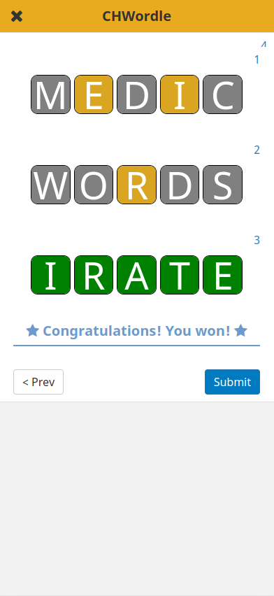

  

_Wordle for the CHT!_

:confused: | :tada:
:---:|:---:
  |  

## Usage

Since this form contains media, [`cht-conf`](https://github.com/medic/cht-conf/) should be used to upload the form to your instance (the `upload-app-forms` operation will upload the images).

The word-pool is 1000 words pulled from the [Medic](https://github.com/medic) documentation and code-base.

### :warning: Not compatible with previous CHT releases :warning:

This form uses several xPath functions that are not available in versions of the CHT `< 4.0.0`. 

- Dynamically calculated `repeat_count` values
- `position` (for checking the current index in a `repeat`)
- `once` (for randomizing the mystery word only once per game)
- `count-non-empty` (for finding how many guesses have been made)

For best results, deploy this form on a CHT instance running CHT `< 4.0.0`.

## Known issues

Existing unresolved issues can be found [here](https://github.com/jkuester/config-cht-demo/issues?q=is%3Aissue+is%3Aopen+sort%3Aupdated-desc+label%3Achwordle).
